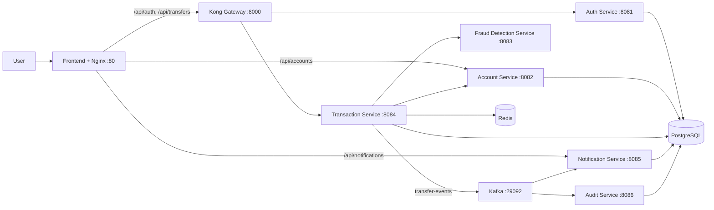

# Mini Banking Transfer System

Hệ thống mô phỏng chuyển tiền nội bộ cho ngân hàng số theo kiến trúc microservices. Ứng dụng hỗ trợ đăng ký và đăng nhập người dùng, tạo tài khoản thanh toán, kiểm tra gian lận giao dịch, chuyển tiền có idempotency, phát thông báo sau giao dịch và lưu audit trail.

> `README.md` này mô tả hiện trạng thực tế của repo. Hạ tầng chạy bằng Docker Compose trong `infra/`, còn các Spring Boot service được chạy local bằng Maven.

## Thành viên nhóm

> Cập nhật lại bảng này theo thông tin nhóm của bạn trước khi nộp bài.

## Phạm vi nghiệp vụ

- Đăng ký và đăng nhập người dùng bằng JWT.
- Tạo và truy vấn tài khoản ngân hàng nội bộ.
- Gửi yêu cầu chuyển tiền giữa hai tài khoản.
- Kiểm tra chống gian lận trước khi ghi nhận giao dịch.
- Trừ tiền, cộng tiền và tự động bù trừ khi bước xử lý sau bị lỗi.
- Phát sự kiện giao dịch để notification-service và audit-service xử lý độc lập.
- Thu thập metrics, traces và correlated logs cho toàn hệ thống.

## Kiến trúc tổng quan



## Thành phần chính

| Thành phần | Cổng | Vai trò |
| --- | --- | --- |
| Frontend + Nginx | `80` | Giao diện người dùng, proxy `/api/accounts` và `/api/notifications` |
| Kong Gateway | `8000` | Entry point cho auth và transfer API |
| Kong Admin API | `8001` | Bootstrap route và consumer JWT |
| Auth Service | `8081` | Đăng ký, đăng nhập, sinh JWT, provision consumer trên Kong |
| Account Service | `8082` | Tạo tài khoản, truy vấn số dư, debit, credit, compensate |
| Fraud Detection Service | `8083` | Đánh giá giao dịch theo rule chống gian lận |
| Transaction Service | `8084` | Điều phối luồng chuyển tiền, idempotency, outbox, compensation |
| Notification Service | `8085` | Nhận event Kafka và lưu thông báo cho tài khoản |
| Audit Service | `8086` | Nhận event Kafka và ghi nhận audit bất biến |
| PostgreSQL | `5432` | Lưu dữ liệu cho auth, account, transaction, notification, audit và Kong |
| Redis | `6379` | Lưu idempotency record cho transaction-service |
| Kafka | `29092` | Phát và tiêu thụ sự kiện `transfer-events` |

### Observability profile

Khi chạy profile `full`, hệ thống bật thêm:

- Prometheus: `http://localhost:9090`
- Grafana: `http://localhost:3000`
- Jaeger: `http://localhost:16686`
- Elasticsearch: `http://localhost:9200`
- Kibana: `http://localhost:5601`
- OTEL Collector: `4317`, `4318`, `9464`

## Công nghệ sử dụng

- Java `21`, Maven, Spring Boot `3.3.5`
- Spring Web, Spring Data JPA, Spring Security, Spring Kafka, Actuator
- Resilience4j cho circuit breaker ở transaction-service
- PostgreSQL, Redis, Kafka, Kong Gateway
- OpenTelemetry, Prometheus, Grafana, Jaeger, Elasticsearch, Kibana
- Frontend tĩnh bằng HTML, CSS, JavaScript

## Chạy hệ thống local

### Yêu cầu

- Java `21`
- Maven `3.9+`
- Docker Desktop
- PowerShell hoặc Bash

### 1. Khởi động hạ tầng

Chạy profile `core` nếu chỉ cần môi trường chính:

```powershell
docker compose -f infra/docker-compose.yml --profile core up -d
```

Chạy profile `full` nếu cần observability:

```powershell
docker compose -f infra/docker-compose.yml --profile full up -d
```

### 2. Khởi động các Spring Boot service

Trên Windows PowerShell:

```powershell
.\scripts\start-services.ps1
```

Trên Bash:

```bash
bash ./scripts/start-services.sh
```

> Lưu ý: `Kong` và `Nginx` trong `infra/` đang gọi các service local qua các cổng host `8081`, `8082`, `8084`, `8085`. Vì vậy các backend service phải chạy trên máy host trước khi frontend và gateway hoạt động đầy đủ.

### 3. Nạp dữ liệu demo

PowerShell:

```powershell
.\scripts\seed-demo-data.ps1
```

Bash:

```bash
bash ./scripts/seed-demo-data.sh
```

Script seed tạo sẵn hai người dùng demo:

| Username | Password | Account | Số dư khởi tạo |
| --- | --- | --- | --- |
| `alice` | `secret123` | `100001` | `1,000,000,000` |
| `bob` | `secret123` | `200001` | `500,000` |

### 4. Mở ứng dụng

- Frontend: `http://localhost`
- Gateway proxy: `http://localhost:8000`
- Kong Admin: `http://localhost:8001`

## Kiểm tra nhanh

Kiểm tra health của các service:

```powershell
curl http://localhost:8081/actuator/health
curl http://localhost:8082/actuator/health
curl http://localhost:8083/actuator/health
curl http://localhost:8084/actuator/health
curl http://localhost:8085/actuator/health
curl http://localhost:8086/actuator/health
```

Chạy smoke test cho auth + transfer + idempotency:

```powershell
.\scripts\smoke-auth-transfer.ps1
```

## API chính

| API | Truy cập qua | Mục đích |
| --- | --- | --- |
| `POST /api/auth/register` | Kong `:8000` | Tạo người dùng mới |
| `POST /api/auth/login` | Kong `:8000` | Đăng nhập và lấy JWT |
| `POST /api/transfers` | Kong `:8000` | Tạo lệnh chuyển tiền, yêu cầu `Authorization` và `Idempotency-Key` |
| `POST /accounts` | Account service `:8082` hoặc frontend `/api/accounts` | Tạo tài khoản |
| `GET /accounts/{accountNumber}` | Account service `:8082` hoặc frontend `/api/accounts/{accountNumber}` | Xem thông tin tài khoản |
| `GET /accounts/by-owner/{ownerName}` | Account service `:8082` hoặc frontend `/api/accounts/by-owner/{ownerName}` | Tìm tài khoản theo chủ sở hữu |
| `GET /notifications/account/{accountNumber}` | Notification service `:8085` hoặc frontend `/api/notifications/account/{accountNumber}` | Lấy danh sách thông báo |

## Đặc điểm kỹ thuật nổi bật

- `transaction-service` dùng `Idempotency-Key` để tránh tạo trùng giao dịch khi client retry.
- Nếu debit thành công nhưng credit thất bại, hệ thống gọi compensate để hoàn tiền cho tài khoản nguồn.
- `notification-service` và `audit-service` tiêu thụ sự kiện từ Kafka theo kiểu bất đồng bộ.
- Mỗi service đều xuất `health`, `metrics` và trace data để phục vụ giám sát.
- Frontend tự tạo tài khoản thanh toán cho user mới nếu chưa có account mapping.

## Tài liệu dự án

- [Phân tích nghiệp vụ theo SOA](docs/analysis-and-design.md)
- [Tài liệu kiến trúc](docs/architecture.md)
- [Đặc tả API](docs/api-specs/)

## OpenAPI

- [auth-service](docs/api-specs/auth-service.yaml)
- [account-service](docs/api-specs/account-service.yaml)
- [fraud-detection-service](docs/api-specs/fraud-detection-service.yaml)
- [transaction-service](docs/api-specs/transaction-service.yaml)
- [notification-service](docs/api-specs/notification-service.yaml)
- [audit-service](docs/api-specs/audit-service.yaml)
