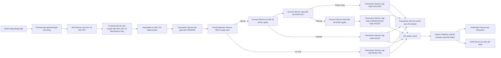
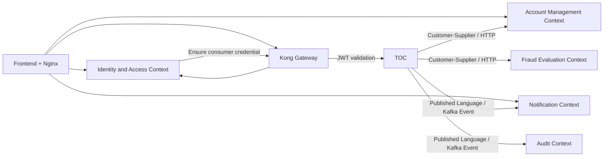
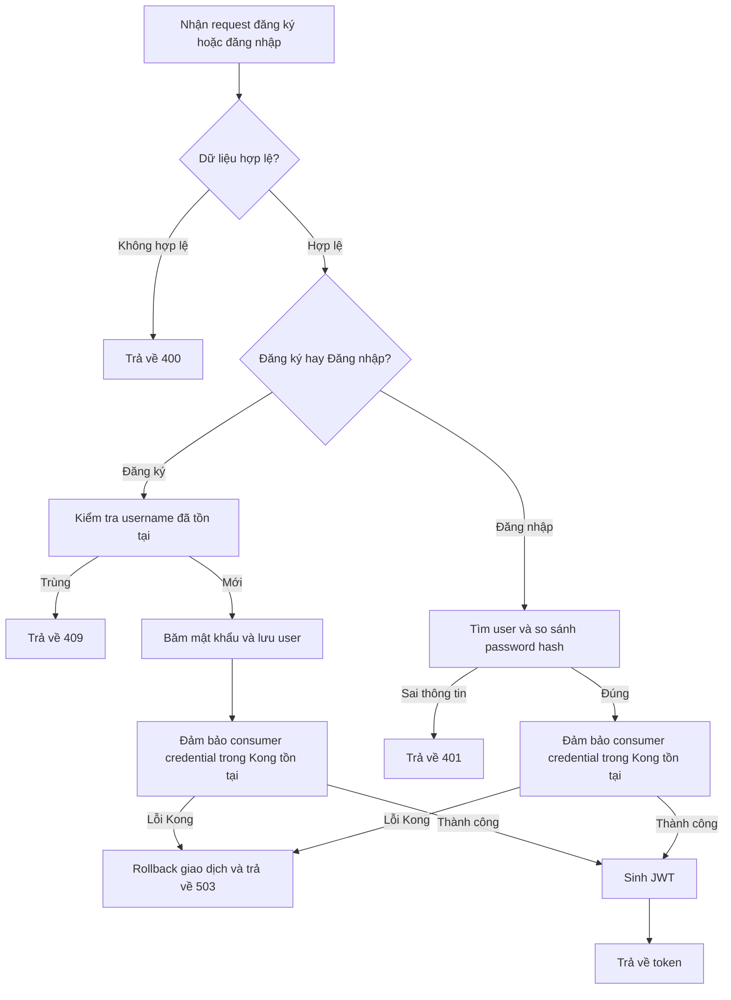
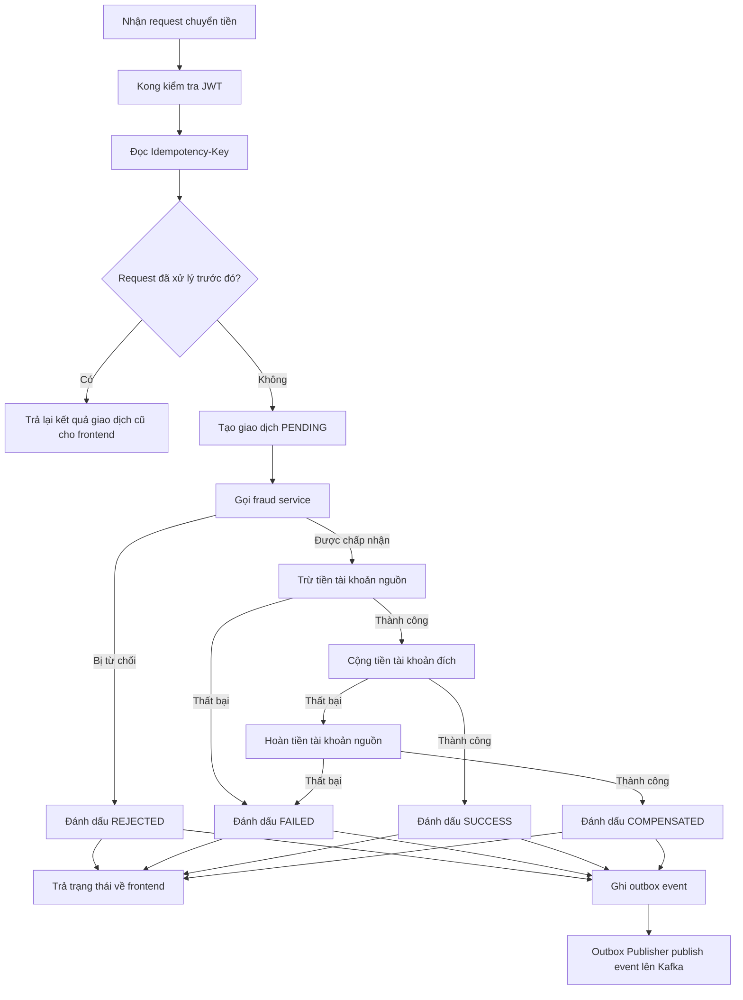
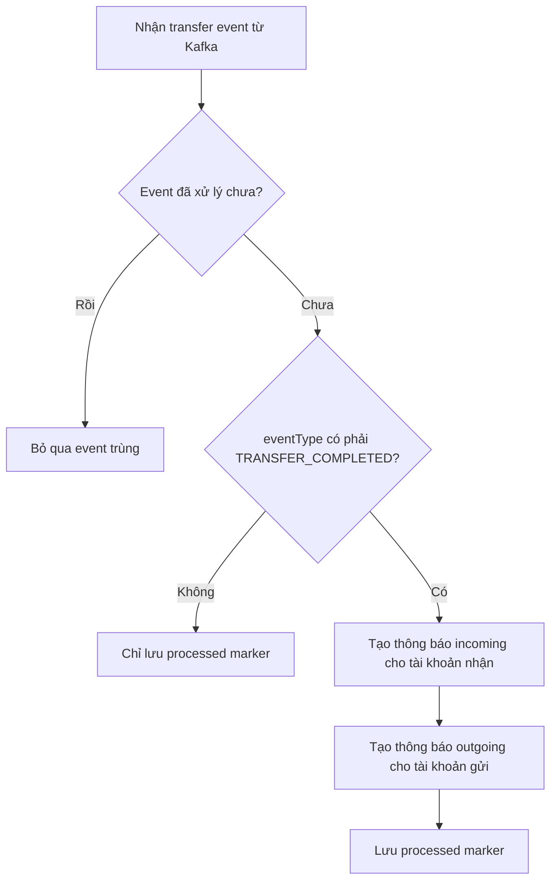

# Phân tích và Thiết kế - Hướng tiếp cận Domain-Driven Design

> Tài liệu này sử dụng hướng tiếp cận Strategic DDD và được viết bám sát với phiên bản hiện tại của dự án Mini Banking Transfer System.
> Phạm vi tập trung vào quy trình nghiệp vụ chính: đăng ký, đăng nhập, chuyển tiền nội bộ và xử lý thông báo giao dịch.

**Tài liệu tham khảo:**
1. *Domain-Driven Design: Tackling Complexity in the Heart of Software* - Eric Evans
2. *Microservices Patterns: With Examples in Java* - Chris Richardson
3. *Bài tập - Phát triển phần mềm hướng dịch vụ* - Hùng Đặng

---

## Phần 1 - Khám phá miền nghiệp vụ

### 1.1 Định nghĩa quy trình nghiệp vụ

- **Lĩnh vực**: Ngân hàng số / chuyển tiền nội bộ.
- **Quy trình nghiệp vụ**: Người dùng đăng ký hoặc đăng nhập để nhận JWT, sau đó thực hiện giao dịch chuyển tiền giữa hai tài khoản trong cùng hệ thống. Khi giao dịch kết thúc, hệ thống phát sự kiện để tạo thông báo và lưu vết audit.
- **Tác nhân**: Khách hàng, Frontend, Nginx, Kong API Gateway, Auth Service, Transaction Service, Fraud Detection Service, Account Service, Notification Service, Audit Service.
- **Phạm vi**: Đăng ký, đăng nhập, xác thực JWT qua gateway cho API chuyển tiền, kiểm tra gian lận, trừ tiền, cộng tiền, hoàn tiền khi lỗi, lưu trạng thái giao dịch, ghi outbox event, publish Kafka event, tạo thông báo và ghi audit.

**Sơ đồ quy trình chuyển tiền:**

### 1.2 Hệ thống hiện có liên quan đến quy trình

| Tên hệ thống | Loại | Vai trò hiện tại | Cách tương tác |
|-------------|------|------------------|----------------|
| Nginx | Reverse proxy / static web server | Phục vụ frontend và chuyển tiếp request `/api/*` tới backend phù hợp | HTTP reverse proxy |
| Kong Gateway | API Gateway | Định tuyến auth/transfer và kiểm tra JWT cho API chuyển tiền | HTTP routing + JWT plugin |
| PostgreSQL | Cơ sở dữ liệu quan hệ | Lưu user, account, transfer và dữ liệu nghiệp vụ chính | Spring Data JPA |
| Redis | Bộ nhớ key-value | Lưu idempotency record để tránh request chuyển tiền bị thực thi lặp lại | Key-value access |
| Kafka | Message broker | Phát tán transfer event sang notification và audit service | Publish/subscribe |
| Frontend Web App | Client application | Cho phép đăng ký, đăng nhập, chuyển tiền, xem số dư và xem thông báo | HTTP/JSON |

### 1.3 Yêu cầu phi chức năng

| Yêu cầu | Mô tả |
|--------|-------|
| Hiệu năng | Luồng chuyển tiền chính cần phản hồi nhanh cho frontend, còn notification và audit được đẩy sang xử lý bất đồng bộ qua Kafka. |
| Bảo mật | Người dùng phải đăng nhập để nhận JWT; Kong xác thực JWT trước khi cho phép gọi API chuyển tiền, còn account và notification được Nginx reverse proxy trực tiếp. |
| Khả năng mở rộng | Các service được tách theo trách nhiệm để có thể mở rộng độc lập, đặc biệt là transaction, notification và audit. |
| Tính sẵn sàng | Circuit breaker, idempotency, outbox và compensation logic được dùng để giảm lỗi dây chuyền và bảo vệ tính nhất quán nghiệp vụ. |

---

## Phần 2 - Domain-Driven Design chiến lược

### 2.1 Event Storming - Các sự kiện nghiệp vụ

| # | Sự kiện nghiệp vụ | Lệnh kích hoạt | Mô tả |
|---|-------------------|----------------|------|
| 1 | UserRegistered | RegisterUser | Người dùng mới được tạo trong auth-service. |
| 2 | UserLoggedIn | LoginUser | Người dùng đăng nhập hợp lệ và nhận JWT token. |
| 3 | KongConsumerEnsured | EnsureKongConsumer | Auth service đảm bảo consumer/JWT credential theo username tồn tại trong Kong. |
| 4 | TransferRequested | SubmitTransfer | Người dùng gửi yêu cầu chuyển tiền với số tài khoản nguồn, đích và số tiền. |
| 5 | FraudCheckCompleted | EvaluateTransferFraud | Fraud service đánh giá giao dịch theo luật kiểm tra gian lận. |
| 6 | TransferRejected | RejectTransfer | Giao dịch bị từ chối trước khi cập nhật số dư. |
| 7 | SourceAccountDebited | DebitSourceAccount | Tài khoản nguồn bị trừ tiền. |
| 8 | DestinationAccountCredited | CreditDestinationAccount | Tài khoản đích được cộng tiền. |
| 9 | TransferSucceeded | CompleteTransfer | Giao dịch hoàn tất thành công. |
| 10 | TransferFailed | FailTransfer | Giao dịch thất bại do lỗi ở bước xử lý. |
| 11 | TransferCompensated | CompensateTransfer | Hệ thống hoàn tiền lại cho tài khoản nguồn sau khi bước cộng tiền thất bại. |
| 12 | TransferResponseReturned | ReturnTransferResult | Transaction service trả trạng thái cuối về frontend. |
| 13 | TransferOutboxRecorded | RecordTransferOutbox | Kết quả giao dịch được ghi vào outbox. |
| 14 | TransferEventPublished | PublishTransferEvent | Outbox publisher phát transfer event lên Kafka. |
| 15 | IncomingNotificationCreated | ConsumeCompletedTransferForRecipient | Notification service tạo thông báo cho tài khoản nhận tiền. |
| 16 | OutgoingNotificationCreated | ConsumeCompletedTransferForSender | Notification service tạo thông báo cho tài khoản chuyển tiền. |
| 17 | AuditEventRecorded | ConsumeTransferEventForAudit | Audit service lưu vết nghiệp vụ từ transfer event. |

### 2.2 Commands và tác nhân

| Command | Tác nhân | Kích hoạt sự kiện |
|---------|----------|-------------------|
| RegisterUser | Khách hàng | UserRegistered |
| LoginUser | Khách hàng | UserLoggedIn |
| EnsureKongConsumer | Auth Service | KongConsumerEnsured |
| SubmitTransfer | Khách hàng | TransferRequested |
| EvaluateTransferFraud | Transaction Service | FraudCheckCompleted |
| RejectTransfer | Transaction Service | TransferRejected |
| DebitSourceAccount | Transaction Service | SourceAccountDebited |
| CreditDestinationAccount | Transaction Service | DestinationAccountCredited |
| CompleteTransfer | Transaction Service | TransferSucceeded |
| FailTransfer | Transaction Service | TransferFailed |
| CompensateTransfer | Transaction Service | TransferCompensated |
| ReturnTransferResult | Transaction Service | TransferResponseReturned |
| RecordTransferOutbox | Transaction Service | TransferOutboxRecorded |
| PublishTransferEvent | Outbox Publisher | TransferEventPublished |
| ConsumeCompletedTransferForRecipient | Notification Service | IncomingNotificationCreated |
| ConsumeCompletedTransferForSender | Notification Service | OutgoingNotificationCreated |
| ConsumeTransferEventForAudit | Audit Service | AuditEventRecorded |

### 2.3 Aggregate

| Aggregate | Commands | Sự kiện nghiệp vụ | Dữ liệu sở hữu |
|-----------|----------|-------------------|----------------|
| User | RegisterUser, LoginUser, EnsureKongConsumer | UserRegistered, UserLoggedIn, KongConsumerEnsured | userId, username, passwordHash |
| Transfer | SubmitTransfer, RejectTransfer, CompleteTransfer, FailTransfer, CompensateTransfer, ReturnTransferResult, RecordTransferOutbox | TransferRequested, TransferRejected, TransferSucceeded, TransferFailed, TransferCompensated, TransferResponseReturned, TransferOutboxRecorded | transferId, userId, sourceAccount, destinationAccount, amount, status, idempotencyKey |
| Account | DebitSourceAccount, CreditDestinationAccount, CompensateTransfer | SourceAccountDebited, DestinationAccountCredited | accountNumber, ownerName, balance, status |
| Notification | ConsumeCompletedTransferForRecipient, ConsumeCompletedTransferForSender | IncomingNotificationCreated, OutgoingNotificationCreated | notificationId, eventId, transferId, recipientAccount, sourceAccount, message, status, createdAt |
| Audit Record | ConsumeTransferEventForAudit | AuditEventRecorded | auditId, eventId, transferId, status, message, createdAt |
| Outbox Event | RecordTransferOutbox, PublishTransferEvent | TransferOutboxRecorded, TransferEventPublished | outboxId, aggregateId, eventType, payload, published, createdAt |

### 2.4 Bounded Context

| Bounded Context | Aggregate | Trách nhiệm |
|-----------------|-----------|-------------|
| Identity and Access Context | User | Đăng ký người dùng, xác thực đăng nhập, sinh JWT và đảm bảo Kong có consumer phù hợp với username |
| Transfer Orchestration Context | Transfer, Outbox Event | Điều phối toàn bộ luồng chuyển tiền, quản lý trạng thái giao dịch, idempotency, outbox và compensation |
| Account Management Context | Account | Cập nhật số dư và xử lý debit/credit/compensate cho tài khoản |
| Fraud Evaluation Context | Quyết định rủi ro giao dịch | Đánh giá giao dịch theo các luật chống gian lận đơn giản |
| Notification Context | Notification | Tạo và truy vấn thông báo theo kết quả giao dịch |
| Audit Context | Audit Record | Lưu các bản ghi audit bất biến từ transfer event |

### 2.5 Context Map

| Upstream | Downstream | Loại quan hệ |
|----------|------------|--------------|
| Frontend + Nginx | Identity and Access Context | Open Host Service qua HTTP |
| Frontend + Nginx | Account Management Context | Open Host Service qua HTTP |
| Frontend + Nginx | Kong Gateway | Entry point cho auth và transfer |
| Identity and Access Context | Kong Gateway | Bổ sung consumer credential theo username |
| Kong Gateway | Transfer Orchestration Context | JWT Gateway protection |
| Transfer Orchestration Context | Account Management Context | Customer/Supplier |
| Transfer Orchestration Context | Fraud Evaluation Context | Customer/Supplier |
| Transfer Orchestration Context | Notification Context | Published Language |
| Transfer Orchestration Context | Audit Context | Published Language |

---

## Phần 3 - Thiết kế hướng dịch vụ

### 3.1 Thiết kế contract đồng nhất

Đặc tả service contract cho các service chính trong phạm vi hiện tại.

**Auth Service:**

| Endpoint | Method | Media Type | Mã phản hồi |
|----------|--------|------------|-------------|
| `/auth/register` | POST | `application/json` | `201`, `400`, `409`, `503` |
| `/auth/login` | POST | `application/json` | `200`, `400`, `401`, `503` |

**Transaction Service:**

| Endpoint | Method | Media Type | Mã phản hồi |
|----------|--------|------------|-------------|
| `/transfers` | POST | `application/json` | `200`, `400`, `401`, `409` |
| `/transfers/{transferId}` | GET | `application/json` | `200`, `404` |

**Account Service:**

| Endpoint | Method | Media Type | Mã phản hồi |
|----------|--------|------------|-------------|
| `/accounts/{accountNumber}` | GET | `application/json` | `200`, `404` |
| `/accounts/debit` | POST | `application/json` | `200`, `404`, `409` |
| `/accounts/credit` | POST | `application/json` | `200`, `404` |
| `/accounts/compensate` | POST | `application/json` | `200`, `404` |
| `/accounts/by-owner/{ownerName}` | GET | `application/json` | `200`, `404` |
| `/accounts` | POST | `application/json` | `201`, `400`, `409` |

**Notification Service:**

| Endpoint | Method | Media Type | Mã phản hồi |
|----------|--------|------------|-------------|
| `/notifications/account/{accountNumber}` | GET | `application/json` | `200` |
| `/notifications/recipient/{accountNumber}` | GET | `application/json` | `200` |

**Fraud Detection Service:**

| Endpoint | Method | Media Type | Mã phản hồi |
|----------|--------|------------|-------------|
| `/fraud/check` | POST | `application/json` | `200`, `400` |

### 3.2 Thiết kế logic service

**Auth Service:**

**Transaction Service:**

**Notification Service:**

---

## Ghi chú về mức độ khớp với implementation

- Cấu hình route và plugin JWT của Kong là phần cấu hình gateway, không phải được tạo mới ở mỗi lần login. Tuy nhiên trong code hiện tại, auth-service vẫn gọi `ensureConsumer(...)` để đảm bảo consumer/JWT credential theo username tồn tại trong Kong khi đăng ký hoặc đăng nhập.
- Luồng chuyển tiền cốt lõi không bao gồm bước frontend tra cứu hoặc tạo tài khoản; đây là luồng phụ trợ để frontend biết accountNumber của người dùng.
- Transaction service trả trạng thái cuối `SUCCESS`, `FAILED`, `REJECTED` hoặc `COMPENSATED` ngay trong response cho frontend, đồng thời ghi outbox event để xử lý bất đồng bộ phía sau.
- Notification không phải bước đồng bộ của transfer flow; đây là luồng hậu xử lý chạy sau khi event được publish lên Kafka.
- Notification service hiện chỉ tạo thông báo khi event type là `TRANSFER_COMPLETED`, và tạo hai bản ghi riêng: một cho người gửi, một cho người nhận.
- Account service không còn đi qua Kong; hiện tại `/api/accounts` được Nginx reverse proxy trực tiếp tới `account-service`, giúp tránh cấu hình chồng chéo giữa Nginx và Kong.

