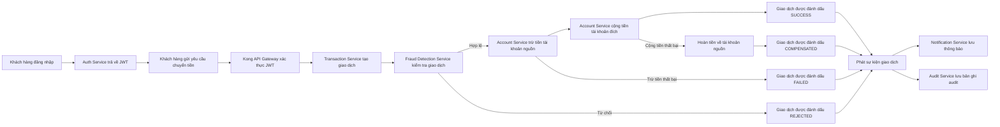
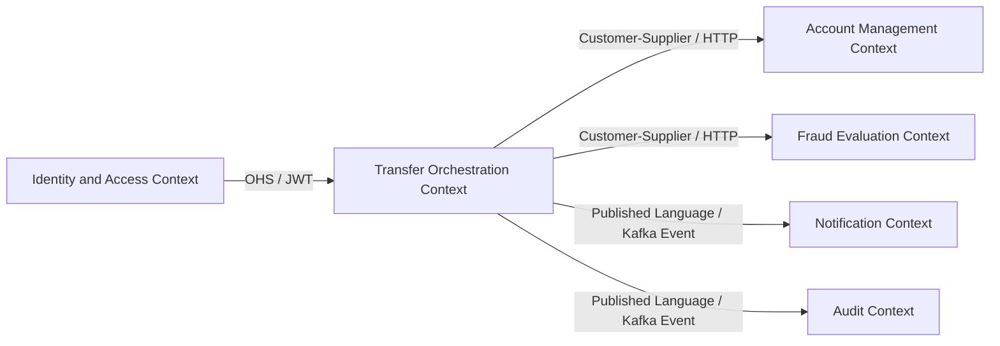
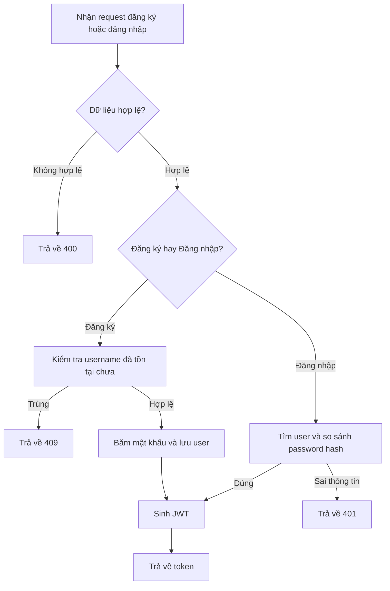
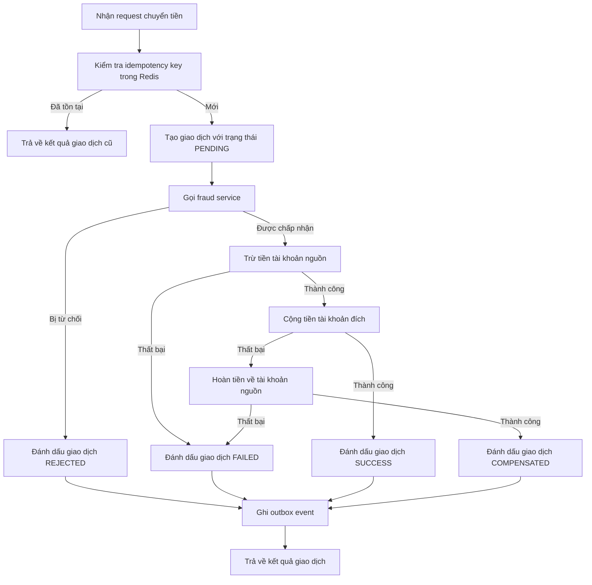
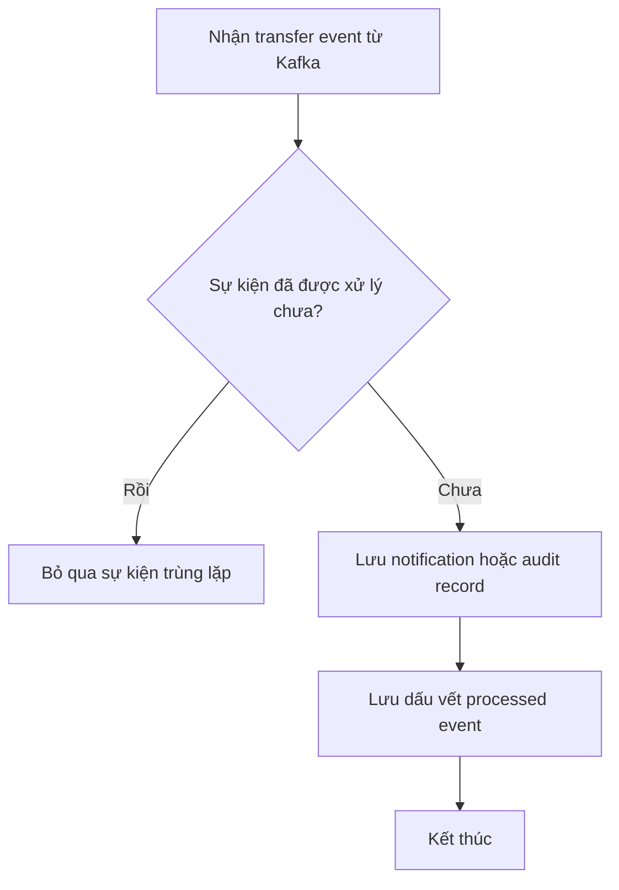

# Phân tích và Thiết kế - Hướng tiếp cận Domain-Driven Design

> Tài liệu này sử dụng hướng tiếp cận Strategic DDD và được viết bám sát với phiên bản hiện tại của dự án Mini Banking Transfer System.
> Phạm vi chỉ tập trung vào một quy trình nghiệp vụ cốt lõi: chuyển tiền giữa hai tài khoản trong cùng hệ thống.

**Tài liệu tham khảo:**
1. *Domain-Driven Design: Tackling Complexity in the Heart of Software* - Eric Evans
2. *Microservices Patterns: With Examples in Java* - Chris Richardson
3. *Bài tập - Phát triển phần mềm hướng dịch vụ* - Hùng Đặng

---

## Phần 1 - Khám phá miền nghiệp vụ

### 1.1 Định nghĩa quy trình nghiệp vụ

- **Lĩnh vực**: Ngân hàng số / chuyển tiền nội bộ
- **Quy trình nghiệp vụ**: Xác thực người dùng và thực hiện giao dịch chuyển tiền giữa hai tài khoản trong cùng hệ thống ngân hàng
- **Tác nhân**: Khách hàng, API Gateway, Auth Service, Transaction Service, Fraud Detection Service, Account Service, Notification Service, Audit Service
- **Phạm vi**: Đăng nhập, gửi yêu cầu chuyển tiền, kiểm tra gian lận, trừ tiền tài khoản nguồn, cộng tiền tài khoản đích, hoàn tiền khi có lỗi, phát sự kiện, tạo thông báo và ghi nhật ký audit

**Sơ đồ quy trình:**

### 1.2 Hệ thống hiện có liên quan đến quy trình

| Tên hệ thống | Loại | Vai trò hiện tại | Cách tương tác |
|-------------|------|------------------|----------------|
| Kong Gateway | API Gateway | Điểm vào chung cho các API bên ngoài và kiểm tra JWT | Định tuyến HTTP qua `/api/*` |
| PostgreSQL | Cơ sở dữ liệu quan hệ | Lưu người dùng, tài khoản, giao dịch và dữ liệu nghiệp vụ cần tồn tại lâu dài | Spring Data JPA |
| Redis | Bộ nhớ key-value | Lưu idempotency record để tránh thực thi trùng lặp giao dịch | Key-value access |
| Kafka | Message broker | Phân phối sự kiện giao dịch cho các service xử lý phía sau | Publish/subscribe |
| Ứng dụng frontend | Client application | Cho phép đăng nhập và gửi yêu cầu chuyển tiền | HTTP/JSON |

### 1.3 Yêu cầu phi chức năng

| Yêu cầu | Mô tả |
|--------|-------|
| Hiệu năng | Xử lý giao dịch chuyển tiền cần phản hồi nhanh với các request thông thường, trong khi notification và audit được xử lý bất đồng bộ qua Kafka. |
| Bảo mật | Người dùng phải được xác thực trước khi gọi các thao tác được bảo vệ. Mật khẩu được băm bằng BCrypt và endpoint chuyển tiền được bảo vệ bằng JWT tại gateway. |
| Khả năng mở rộng | Các service được tách theo trách nhiệm để có thể mở rộng độc lập, đặc biệt là transaction processing và các event consumer. |
| Tính sẵn sàng | Circuit breaker, compensation logic, idempotency và xử lý bất đồng bộ được sử dụng để giảm lỗi dây chuyền và tăng độ bền vững cho hệ thống. |

---

## Phần 2 - Domain-Driven Design chiến lược

### 2.1 Event Storming - Các sự kiện nghiệp vụ

| # | Sự kiện nghiệp vụ | Lệnh kích hoạt | Mô tả |
|---|-------------------|----------------|------|
| 1 | UserRegistered | RegisterUser | Một tài khoản người dùng mới được tạo trong miền xác thực. |
| 2 | UserLoggedIn | LoginUser | Người dùng đăng nhập hợp lệ và nhận JWT token. |
| 3 | TransferRequested | SubmitTransfer | Người dùng gửi yêu cầu chuyển tiền gồm tài khoản nguồn, tài khoản đích và số tiền. |
| 4 | FraudCheckCompleted | EvaluateTransferFraud | Các luật kiểm tra gian lận được thực thi cho giao dịch. |
| 5 | TransferRejected | RejectTransfer | Giao dịch bị từ chối do vi phạm luật gian lận. |
| 6 | SourceAccountDebited | DebitSourceAccount | Tiền được trừ khỏi tài khoản nguồn. |
| 7 | DestinationAccountCredited | CreditDestinationAccount | Tiền được cộng vào tài khoản đích. |
| 8 | TransferSucceeded | CompleteTransfer | Giao dịch chuyển tiền hoàn thành thành công. |
| 9 | TransferFailed | FailTransfer | Giao dịch thất bại do lỗi kỹ thuật hoặc một bước nghiệp vụ không thực hiện được. |
| 10 | TransferCompensated | CompensateTransfer | Tài khoản nguồn được hoàn tiền sau khi bước cộng tiền thất bại. |
| 11 | TransferEventPublished | PublishTransferEvent | Sự kiện kết quả giao dịch được ghi nhận và phát cho các service phía sau. |
| 12 | NotificationCreated | ConsumeTransferEventForNotification | Sự kiện giao dịch được chuyển thành bản ghi thông báo cho người dùng. |
| 13 | AuditEventRecorded | ConsumeTransferEventForAudit | Sự kiện giao dịch được lưu thành bản ghi audit. |

### 2.2 Commands và tác nhân

| Command | Tác nhân | Kích hoạt sự kiện |
|---------|----------|-------------------|
| RegisterUser | Khách hàng | UserRegistered |
| LoginUser | Khách hàng | UserLoggedIn |
| SubmitTransfer | Khách hàng | TransferRequested |
| EvaluateTransferFraud | Transaction Service | FraudCheckCompleted |
| RejectTransfer | Transaction Service | TransferRejected |
| DebitSourceAccount | Transaction Service | SourceAccountDebited |
| CreditDestinationAccount | Transaction Service | DestinationAccountCredited |
| CompleteTransfer | Transaction Service | TransferSucceeded |
| FailTransfer | Transaction Service | TransferFailed |
| CompensateTransfer | Transaction Service | TransferCompensated |
| PublishTransferEvent | Transaction Service / Outbox Publisher | TransferEventPublished |
| ConsumeTransferEventForNotification | Notification Service | NotificationCreated |
| ConsumeTransferEventForAudit | Audit Service | AuditEventRecorded |

### 2.3 Aggregate

| Aggregate | Commands | Sự kiện nghiệp vụ | Dữ liệu sở hữu |
|-----------|----------|-------------------|----------------|
| User | RegisterUser, LoginUser | UserRegistered, UserLoggedIn | userId, username, passwordHash |
| Account | CreateAccount, DebitSourceAccount, CreditDestinationAccount, CompensateTransfer | SourceAccountDebited, DestinationAccountCredited | accountNumber, ownerName, balance, status |
| Transfer | SubmitTransfer, RejectTransfer, CompleteTransfer, FailTransfer, CompensateTransfer, PublishTransferEvent | TransferRequested, TransferRejected, TransferSucceeded, TransferFailed, TransferCompensated, TransferEventPublished | transferId, userId, sourceAccount, destinationAccount, amount, status, idempotencyKey |
| Notification | ConsumeTransferEventForNotification | NotificationCreated | notificationId, eventId, transferId, status, message, createdAt |
| Audit Record | ConsumeTransferEventForAudit | AuditEventRecorded | auditId, eventId, transferId, status, message, createdAt |

### 2.4 Bounded Context

| Bounded Context | Aggregate | Trách nhiệm |
|-----------------|-----------|-------------|
| Identity and Access Context | User | Đăng ký người dùng, kiểm tra thông tin đăng nhập, sinh JWT token |
| Account Management Context | Account | Tạo tài khoản và quản lý số dư tài khoản |
| Transfer Orchestration Context | Transfer | Điều phối toàn bộ quy trình chuyển tiền và quản lý trạng thái cuối của giao dịch |
| Fraud Evaluation Context | Transfer risk decision | Đánh giá các luật nghiệp vụ để chấp nhận hoặc từ chối giao dịch |
| Notification Context | Notification | Tạo bản ghi thông báo từ sự kiện giao dịch |
| Audit Context | Audit Record | Lưu các bản ghi audit bất biến từ sự kiện giao dịch |

### 2.5 Context Map

| Upstream | Downstream | Loại quan hệ |
|----------|------------|--------------|
| Identity and Access Context | Transfer Orchestration Context | Open Host Service thông qua JWT claims |
| Transfer Orchestration Context | Account Management Context | Customer/Supplier |
| Transfer Orchestration Context | Fraud Evaluation Context | Customer/Supplier |
| Transfer Orchestration Context | Notification Context | Published Language |
| Transfer Orchestration Context | Audit Context | Published Language |

---

## Phần 3 - Thiết kế hướng dịch vụ

### 3.1 Thiết kế contract đồng nhất

Đặc tả service contract cho các bounded context / service chính.

**Auth Service:**

| Endpoint | Method | Media Type | Mã phản hồi |
|----------|--------|------------|-------------|
| `/auth/register` | POST | `application/json` | `201`, `400`, `409` |
| `/auth/login` | POST | `application/json` | `200`, `400`, `401` |

**Account Service:**

| Endpoint | Method | Media Type | Mã phản hồi |
|----------|--------|------------|-------------|
| `/accounts` | POST | `application/json` | `201`, `400`, `409` |
| `/accounts/{accountNumber}` | GET | `application/json` | `200`, `404` |
| `/accounts/debit` | POST | `application/json` | `200`, `404`, `409` |
| `/accounts/credit` | POST | `application/json` | `200`, `404` |
| `/accounts/compensate` | POST | `application/json` | `200`, `404` |

**Transaction Service:**

| Endpoint | Method | Media Type | Mã phản hồi |
|----------|--------|------------|-------------|
| `/transfers` | POST | `application/json` | `200`, `400`, `401`, `409` |
| `/transfers/{transferId}` | GET | `application/json` | `200`, `404` |

**Fraud Detection Service:**

| Endpoint | Method | Media Type | Mã phản hồi |
|----------|--------|------------|-------------|
| `/fraud/check` | POST | `application/json` | `200`, `400` |

### 3.2 Thiết kế logic service

**Auth Service:**

**Transaction Service:**

**Notification và Audit Consumer:**

---

## Ghi chú về mức độ khớp với implementation

- Phiên bản hiện tại của dự án tập trung vào luồng chuyển tiền và phù hợp tốt với các khái niệm DDD như bounded context, aggregate, command và domain event.
- Transfer orchestration được cài đặt trong `transaction-service`, đóng vai trò application service điều phối quy trình theo hướng saga.
- Notification và audit được xử lý bất đồng bộ thông qua Kafka event.
- Một số endpoint tích hợp frontend hiện vẫn mang tính chất demo, vì vậy tài liệu này ưu tiên mô tả luồng nghiệp vụ backend cốt lõi đã được cài đặt rõ ràng.
