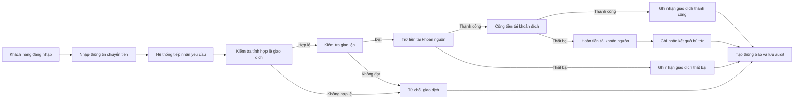
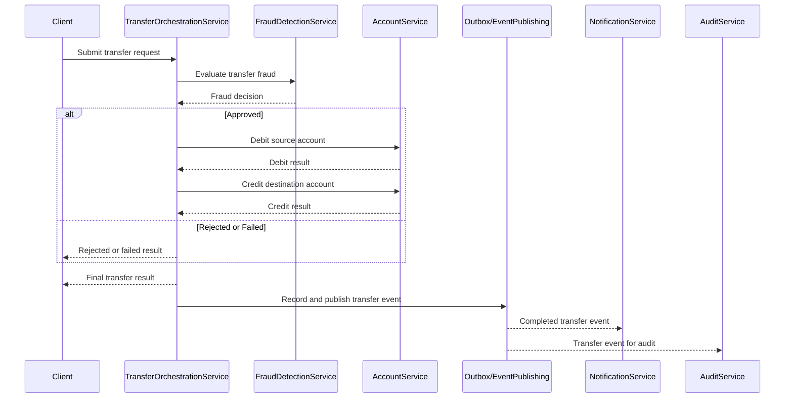
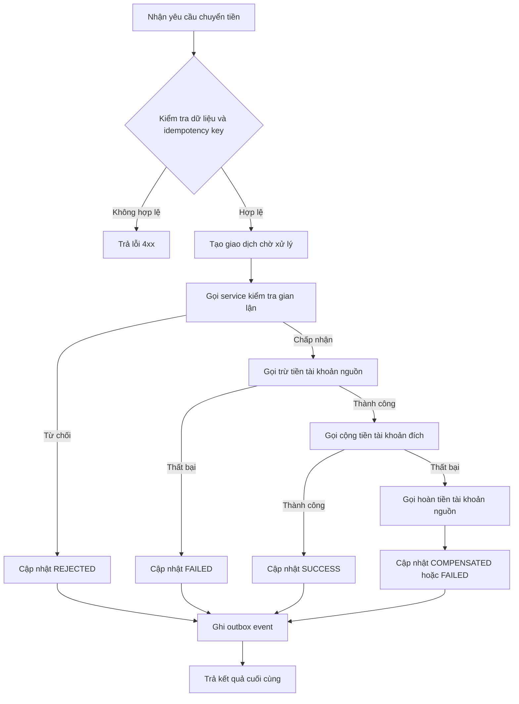
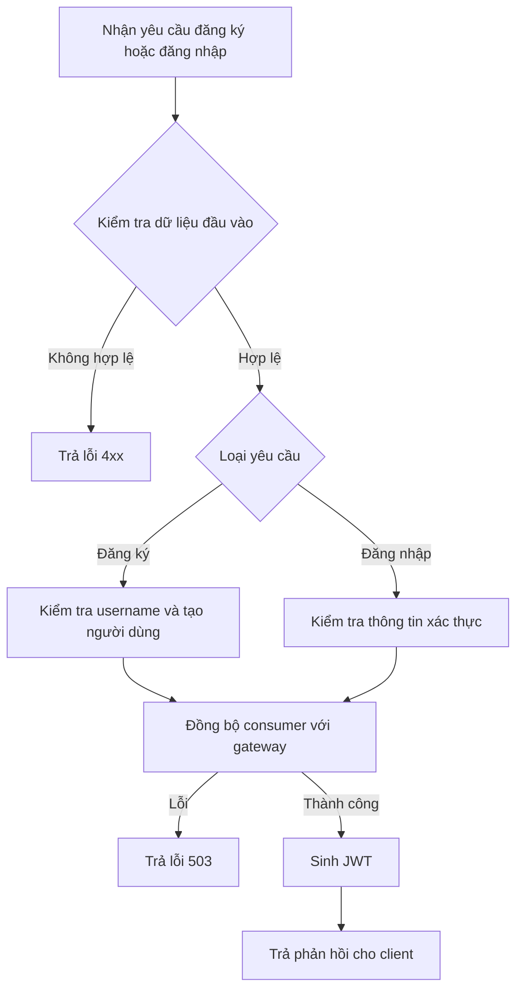
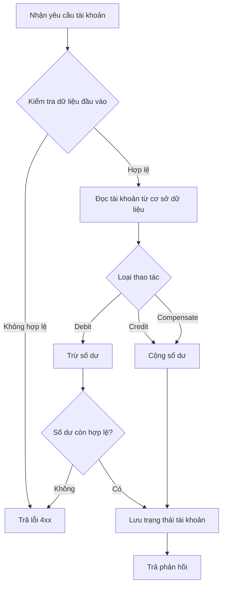
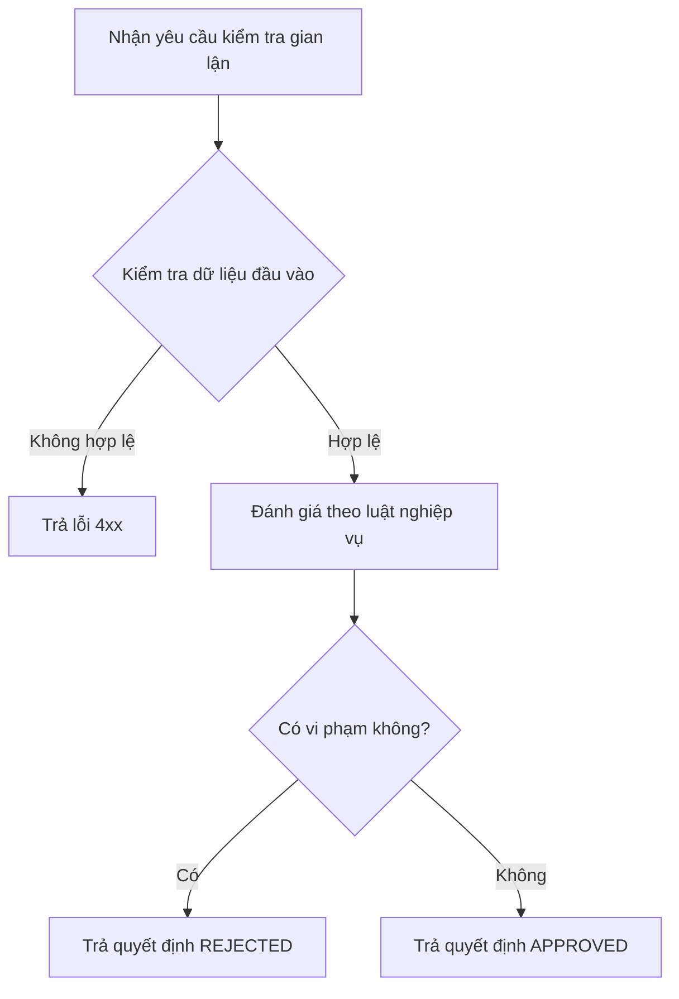
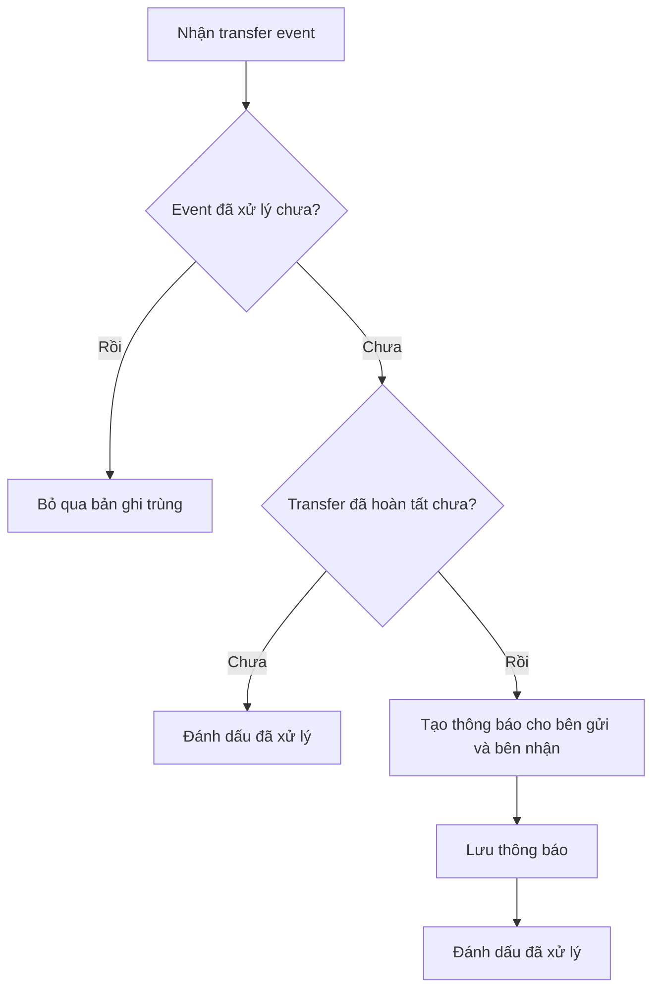
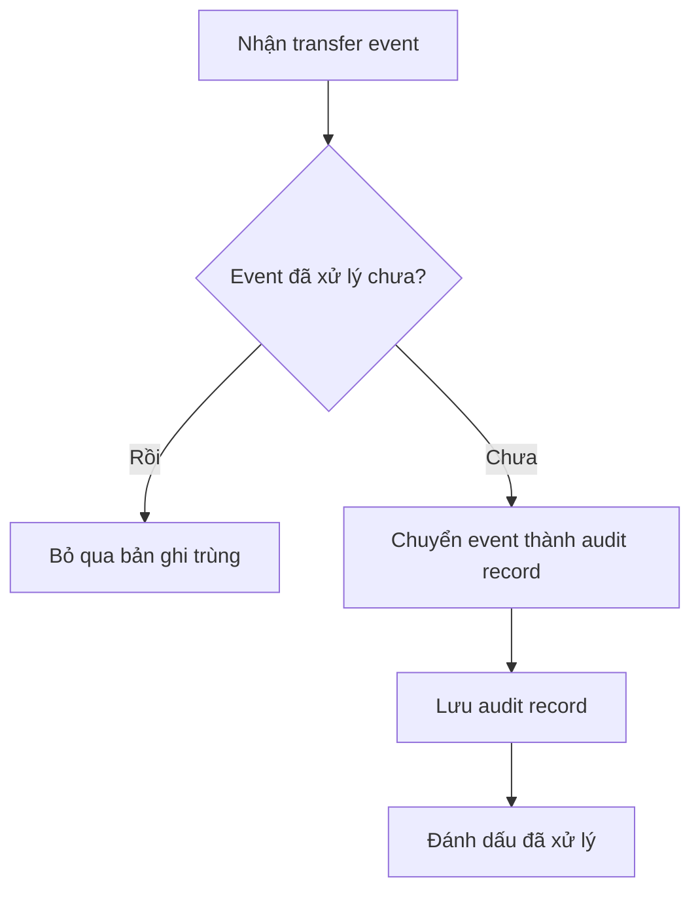

# Analysis and Design — Business Process Automation Solution

> **Goal**: Analyze a specific business process and design a service-oriented automation solution (SOA/Microservices).  
> Scope: 4–6 week assignment — focus on **one business process**, not an entire system.

**References:**
1. *Service-Oriented Architecture: Analysis and Design for Services and Microservices* — Thomas Erl (2nd Edition)
2. *Microservices Patterns: With Examples in Java* — Chris Richardson
3. *Bài tập — Phát triển phần mềm hướng dịch vụ* — Hung Dang

---

## Part 1 — Analysis Preparation

### 1.1 Business Process Definition

- **Domain**: Ngân hàng số / chuyển tiền nội bộ.
- **Business Process**: Tự động hóa quy trình chuyển tiền giữa hai tài khoản trong cùng hệ thống ngân hàng.
- **Actors**: Khách hàng.
- **Scope**: Đăng nhập, khởi tạo yêu cầu chuyển tiền, kiểm tra tính hợp lệ giao dịch, kiểm tra gian lận, cập nhật số dư tài khoản nguồn và tài khoản đích, hoàn tiền khi cần, ghi nhận kết quả giao dịch, tạo thông báo và lưu vết audit.

**Process Diagram:**

### 1.2 Existing Automation Systems

| System Name | Type | Current Role | Interaction Method |
|-------------|------|--------------|-------------------|
| Frontend Web App | Client application | Thu thập thông tin đăng nhập, thông tin chuyển tiền và hiển thị kết quả cho khách hàng | HTTP/JSON |
| Auth Service | Backend service | Xác thực người dùng và cấp token truy cập | REST API |
| Transaction Service | Backend service | Điều phối quy trình chuyển tiền và quản lý trạng thái giao dịch | REST API |
| Account Service | Backend service | Quản lý tài khoản và cập nhật số dư | REST API |
| Fraud Detection Service | Backend service | Kiểm tra giao dịch theo các luật chống gian lận | REST API |
| Notification Service | Backend service | Lưu và cung cấp thông báo phát sinh từ kết quả giao dịch | Kafka + REST API |
| Audit Service | Backend service | Lưu vết audit cho giao dịch | Kafka consumer |
| PostgreSQL | Relational database | Lưu dữ liệu người dùng, tài khoản, giao dịch, thông báo, audit | JDBC / JPA |
| Redis | Key-value store | Lưu thông tin idempotency để chống xử lý trùng yêu cầu chuyển tiền | Redis access |
| Kafka | Message broker | Truyền transfer event sang notification và audit | Publish/Subscribe |

### 1.3 Non-Functional Requirements

| Requirement | Description |
|-------------|-------------|
| Performance | Luồng chuyển tiền đồng bộ phải phản hồi nhanh cho người dùng; thông báo và audit được xử lý bất đồng bộ để không kéo dài thời gian phản hồi. |
| Security | Chỉ người dùng đã xác thực mới được phép gửi yêu cầu chuyển tiền; dữ liệu giao dịch cần được bảo vệ trên đường truyền và ở mức truy cập API. |
| Scalability | Các chức năng xác thực, điều phối giao dịch, quản lý tài khoản, thông báo và audit cần có khả năng mở rộng độc lập. |
| Availability | Hệ thống phải giảm rủi ro xử lý trùng, hạn chế lỗi dây chuyền khi service phụ bị lỗi, và đảm bảo có thể ghi nhận trạng thái giao dịch nhất quán. |

---

## Part 2 — REST/Microservices Modeling

### 2.1 Decompose Business Process & 2.2 Filter Unsuitable Actions

| # | Action | Actor | Description | Suitable? |
|---|--------|-------|-------------|-----------|
| 1 | Đăng nhập hệ thống | Khách hàng | Người dùng nhập thông tin xác thực để vào hệ thống | ✅ |
| 2 | Nhập thông tin chuyển tiền | Khách hàng | Người dùng nhập tài khoản nguồn, tài khoản đích và số tiền | ❌ |
| 3 | Gửi yêu cầu chuyển tiền | Khách hàng | Yêu cầu chuyển tiền được gửi vào hệ thống | ✅ |
| 4 | Kiểm tra định dạng và dữ liệu đầu vào | Hệ thống | Kiểm tra dữ liệu yêu cầu có hợp lệ hay không | ✅ |
| 5 | Kiểm tra giao dịch trùng | Hệ thống | Xác định yêu cầu đã được xử lý trước đó hay chưa | ✅ |
| 6 | Khởi tạo giao dịch chờ xử lý | Hệ thống | Tạo bản ghi giao dịch ban đầu với trạng thái chờ xử lý | ✅ |
| 7 | Kiểm tra gian lận | Hệ thống | Đánh giá giao dịch theo luật chống gian lận | ✅ |
| 8 | Từ chối giao dịch | Hệ thống | Đánh dấu giao dịch bị từ chối khi không đạt điều kiện | ✅ |
| 9 | Trừ tiền tài khoản nguồn | Hệ thống | Cập nhật số dư tài khoản nguồn | ✅ |
| 10 | Cộng tiền tài khoản đích | Hệ thống | Cập nhật số dư tài khoản đích | ✅ |
| 11 | Hoàn tiền tài khoản nguồn | Hệ thống | Bù trừ khi bước cộng tiền thất bại sau khi đã trừ tiền | ✅ |
| 12 | Cập nhật trạng thái cuối giao dịch | Hệ thống | Ghi nhận giao dịch thành công, thất bại, từ chối hoặc đã bù trừ | ✅ |
| 13 | Trả kết quả cho người dùng | Hệ thống | Phản hồi trạng thái cuối của giao dịch cho client | ✅ |
| 14 | Tạo thông báo giao dịch | Hệ thống | Tạo thông báo cho tài khoản gửi và nhận tiền | ✅ |
| 15 | Ghi audit giao dịch | Hệ thống | Lưu vết giao dịch để phục vụ đối soát và truy vết | ✅ |

> Action marked ❌ is not encapsulated as a service because it is a direct human interaction at UI level.

### 2.3 Entity Service Candidates

| Entity | Service Candidate | Agnostic Actions |
|--------|-------------------|------------------|
| User | Auth Service | Xác thực người dùng |
| Transfer | Transfer Service | Khởi tạo giao dịch, cập nhật trạng thái giao dịch, truy vấn giao dịch |
| Account | Account Service | Tra cứu tài khoản, trừ tiền, cộng tiền, hoàn tiền |
| Notification | Notification Service | Tạo thông báo, truy vấn thông báo |
| Audit Record | Audit Service | Tạo bản ghi audit |

### 2.4 Task Service Candidate

| Non-agnostic Action | Task Service Candidate |
|---------------------|------------------------|
| Tiếp nhận và xử lý yêu cầu chuyển tiền | Transfer Orchestration Service |
| Kiểm tra dữ liệu yêu cầu và điều kiện xử lý | Transfer Orchestration Service |
| Điều phối kiểm tra gian lận | Transfer Orchestration Service |
| Quyết định từ chối hoặc tiếp tục giao dịch | Transfer Orchestration Service |
| Điều phối trừ tiền tài khoản nguồn và cộng tiền tài khoản đích | Transfer Orchestration Service |
| Điều phối bù trừ khi giao dịch xử lý dở dang | Transfer Orchestration Service |
| Trả kết quả cuối cùng cho người dùng | Transfer Orchestration Service |

### 2.5 Identify Resources

| Entity / Process | Resource URI |
|------------------|--------------|
| User authentication | `/auth/login` |
| Transfer process | `/transfers` |
| Account | `/accounts/{accountNumber}` |
| Account debit | `/accounts/debit` |
| Account credit | `/accounts/credit` |
| Account compensation | `/accounts/compensate` |
| Fraud checking | `/fraud/check` |
| Notifications by account | `/notifications/account/{accountNumber}` |

### 2.6 Associate Capabilities with Resources and Methods

| Service Candidate | Capability | Resource | HTTP Method |
|-------------------|------------|----------|-------------|
| Auth Service | Authenticate user | `/auth/login` | POST |
| Transfer Orchestration Service | Submit transfer request | `/transfers` | POST |
| Account Service | Get account information | `/accounts/{accountNumber}` | GET |
| Account Service | Debit account | `/accounts/debit` | POST |
| Account Service | Credit account | `/accounts/credit` | POST |
| Account Service | Compensate account | `/accounts/compensate` | POST |
| Fraud Detection Service | Evaluate fraud rules | `/fraud/check` | POST |
| Notification Service | Query notifications by account | `/notifications/account/{accountNumber}` | GET |

### 2.7 Utility Service & Microservice Candidates

| Candidate | Type (Utility / Microservice) | Justification |
|-----------|-------------------------------|---------------|
| Transfer Orchestration Service | Microservice | Chứa logic quy trình chuyển tiền đặc thù, điều phối nhiều service và cần tách độc lập để bảo đảm tính nhất quán, khả năng chịu lỗi và khả năng mở rộng theo tải giao dịch. |
| Account Service | Microservice | Quản lý số dư và các cập nhật tài khoản có yêu cầu nhất quán cao; cần quyền sở hữu dữ liệu và triển khai độc lập. |
| Fraud Detection Service | Microservice | Chứa luật kiểm tra gian lận chuyên biệt, có thể thay đổi và mở rộng độc lập khỏi luồng cập nhật số dư. |
| Notification Service | Microservice | Xử lý hậu giao dịch bất đồng bộ, có đặc tính tải khác với luồng chính và cần mở rộng riêng. |
| Audit Service | Microservice | Lưu vết audit phục vụ truy vết và đối soát; cần độc lập để không làm tăng độ trễ của giao dịch đồng bộ. |
| Idempotency Handling | Utility | Logic kỹ thuật chống xử lý trùng cho transfer request; hỗ trợ tính sẵn sàng và tính nhất quán nghiệp vụ. |
| Outbox Event Publishing | Utility | Logic kỹ thuật bảo đảm việc ghi nhận kết quả giao dịch và phát event đi được thực hiện tin cậy. |

### 2.8 Service Composition Candidates

---

## Part 3 — Service-Oriented Design

### 3.1 Uniform Contract Design

Service Contract specification for each service. Full OpenAPI specs:
- [`docs/api-specs/auth-service.yaml`](api-specs/auth-service.yaml)
- [`docs/api-specs/account-service.yaml`](api-specs/account-service.yaml)
- [`docs/api-specs/transaction-service.yaml`](api-specs/transaction-service.yaml)
- [`docs/api-specs/fraud-detection-service.yaml`](api-specs/fraud-detection-service.yaml)
- [`docs/api-specs/notification-service.yaml`](api-specs/notification-service.yaml)
- [`docs/api-specs/audit-service.yaml`](api-specs/audit-service.yaml)

**Auth Service:**

| Endpoint | Method | Media Type | Response Codes |
|----------|--------|------------|----------------|
| `/auth/register` | POST | `application/json` | `201`, `400`, `409`, `503` |
| `/auth/login` | POST | `application/json` | `200`, `400`, `401`, `503` |
| `/actuator/health` | GET | `application/json` | `200` |
| `/actuator/prometheus` | GET | `text/plain` | `200` |

**Transfer Orchestration Service:**

| Endpoint | Method | Media Type | Response Codes |
|----------|--------|------------|----------------|
| `/transfers` | POST | `application/json` | `200`, `400`, `401`, `409` |
| `/actuator/health` | GET | `application/json` | `200` |
| `/actuator/prometheus` | GET | `text/plain` | `200` |

**Account Service:**

| Endpoint | Method | Media Type | Response Codes |
|----------|--------|------------|----------------|
| `/accounts` | POST | `application/json` | `201`, `400`, `409` |
| `/accounts/{accountNumber}` | GET | `application/json` | `200`, `404` |
| `/accounts/by-owner/{ownerName}` | GET | `application/json` | `200`, `404` |
| `/accounts/debit` | POST | `application/json` | `200`, `404`, `409` |
| `/accounts/credit` | POST | `application/json` | `200`, `404` |
| `/accounts/compensate` | POST | `application/json` | `200`, `404` |
| `/actuator/health` | GET | `application/json` | `200` |
| `/actuator/prometheus` | GET | `text/plain` | `200` |

**Fraud Detection Service:**

| Endpoint | Method | Media Type | Response Codes |
|----------|--------|------------|----------------|
| `/fraud/check` | POST | `application/json` | `200`, `400` |
| `/actuator/health` | GET | `application/json` | `200` |
| `/actuator/prometheus` | GET | `text/plain` | `200` |

**Notification Service:**

| Endpoint | Method | Media Type | Response Codes |
|----------|--------|------------|----------------|
| `/notifications/account/{accountNumber}` | GET | `application/json` | `200` |
| `/actuator/health` | GET | `application/json` | `200` |
| `/actuator/prometheus` | GET | `text/plain` | `200` |

**Audit Service:**

| Endpoint | Method | Media Type | Response Codes |
|----------|--------|------------|----------------|
| `/actuator/health` | GET | `application/json` | `200` |
| `/actuator/prometheus` | GET | `text/plain` | `200` |

### 3.2 Service Logic Design

**Transfer Orchestration Service:**

**Auth Service:**

**Account Service:**

**Fraud Detection Service:**

**Notification Service:**

**Audit Service:**

