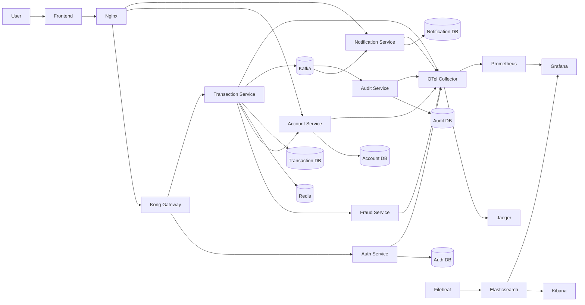

# Kiến trúc hệ thống

> Tài liệu này mô tả kiến trúc thực tế của dự án Mini Banking Transfer System sau khi đã hoàn thiện phân tích nghiệp vụ và triển khai mã nguồn.

**Tài liệu tham khảo:**
1. *Microservices Patterns: With Examples in Java* - Chris Richardson
2. *Building Microservices* - Sam Newman
3. *Bài tập - Phát triển phần mềm hướng dịch vụ* - Hùng Đặng

---

## 1. Lựa chọn pattern

| Pattern | Áp dụng? | Lý do kỹ thuật / nghiệp vụ |
|---------|----------|-----------------------------|
| API Gateway | Có | Kong được dùng cho auth và transfer để gom entry point và kiểm tra JWT cho API chuyển tiền. |
| Reverse Proxy | Có | Nginx phục vụ frontend và route request `/api/*` tới Kong hoặc service phù hợp. |
| Database per Service | Có | Mỗi service sở hữu dữ liệu riêng, tránh phụ thuộc chéo ở tầng database. |
| Shared Database | Không | Không dùng DB chia sẻ logic giữa các service. Các liên kết giữa service là qua API hoặc Kafka event. |
| Saga | Có | `transaction-service` điều phối luồng chuyển tiền nhiều bước và dùng compensate khi credit thất bại. |
| Outbox Pattern | Có | Ghi `outbox_events` trước khi publish Kafka để tránh mất event khi broker lỗi tạm thời. |
| Event-driven / Message Queue | Có | Kafka dùng để phát transfer event sang notification-service và audit-service. |
| Circuit Breaker | Có | Resilience4j bảo vệ lời gọi từ transaction-service sang fraud-service và account-service. |
| Idempotency | Có | Redis lưu `Idempotency-Key` để tránh retry cùng request tạo nhiều transfer. |
| Observability | Có | Metrics Prometheus, tracing OTLP/Jaeger, log correlation với `traceId` / `spanId`. |
| CQRS | Không hoàn chỉnh | Có tách một phần write path và read path theo event ở notification/audit, nhưng chưa triển khai CQRS đầy đủ. |
| Service Registry / Discovery | Không | Môi trường docker-compose dùng tên host và route tĩnh, chưa cần service discovery. |

---

## 2. Thành phần hệ thống

| Thành phần | Trách nhiệm | Công nghệ | Port |
|------------|-------------|-----------|------|
| Frontend + Nginx | Serve giao diện web, reverse proxy cho `/api/*` | HTML/CSS/JS + Nginx | 80 |
| Kong Gateway | Route auth/transfer, kiểm tra JWT cho transfer API | Kong Gateway | 8000 |
| Kong Admin API | Quản trị route, plugin, consumer/JWT credential | Kong Admin | 8001 |
| Auth Service | Đăng ký, đăng nhập, sinh JWT, đồng bộ consumer vào Kong | Spring Boot, Spring Security, PostgreSQL | 8081 |
| Account Service | Tạo tài khoản, tra cứu số dư, debit/credit/compensate | Spring Boot, JPA, PostgreSQL | 8082 |
| Fraud Detection Service | Kiểm tra luật gian lận cho giao dịch | Spring Boot | 8083 |
| Transaction Service | Điều phối chuyển tiền, saga, outbox, idempotency | Spring Boot, JPA, Redis, Kafka | 8084 |
| Notification Service | Consume transfer event, tạo và truy vấn notification | Spring Boot, Kafka, JPA | 8085 |
| Audit Service | Consume transfer event, lưu audit log nghiệp vụ | Spring Boot, Kafka, JPA | 8086 |
| PostgreSQL | Lưu dữ liệu nghiệp vụ của các service | PostgreSQL 16 | 5432 |
| Redis | Lưu idempotency record | Redis 7 | 6379 |
| Kafka | Phát tán transfer event | Kafka 7.6.1 | 29092 |
| Jaeger | Hiển thị distributed trace | Jaeger all-in-one | 16686 |
| OpenTelemetry Collector | Thu thập và chuyển tiếp traces/metrics | OTel Collector | 4317, 4318, 9464 |
| Prometheus | Thu thập metrics từ actuator | Prometheus | 9090 |
| Grafana | Dashboard metrics/logs | Grafana | 3000 |
| Elasticsearch | Lưu log tập trung | Elasticsearch | 9200 |
| Kibana | Tìm kiếm log | Kibana | 5601 |
| Filebeat | Ship log container sang Elasticsearch | Filebeat | - |

---

## 3. Giao tiếp giữa các thành phần

### 3.1 Ma trận giao tiếp

| From -> To | Frontend | Nginx | Kong | Auth | Account | Fraud | Transaction | Notification | Audit | Redis | Kafka | PostgreSQL | OTel Collector | Prometheus |
|------------|----------|-------|------|------|---------|-------|-------------|--------------|-------|-------|-------|------------|----------------|------------|
| Frontend | - | HTTP | - | - | - | - | - | - | - | - | - | - | - | - |
| Nginx | - | - | HTTP | HTTP | HTTP | - | HTTP | HTTP | - | - | - | - | - | - |
| Kong | - | - | - | HTTP | - | - | HTTP | - | - | - | - | - | - | - |
| Auth | - | - | Admin API | - | - | - | - | - | - | - | - | PostgreSQL | OTLP | Prometheus scrape |
| Transaction | - | - | - | - | HTTP | HTTP | - | - | - | Redis | Kafka | PostgreSQL | OTLP | Prometheus scrape |
| Notification | - | - | - | - | - | - | - | - | - | - | Consume | PostgreSQL | OTLP | Prometheus scrape |
| Audit | - | - | - | - | - | - | - | - | - | - | Consume | PostgreSQL | OTLP | Prometheus scrape |
| Account | - | - | - | - | - | - | - | - | - | - | - | PostgreSQL | OTLP | Prometheus scrape |
| Fraud | - | - | - | - | - | - | - | - | - | - | - | - | OTLP | Prometheus scrape |

### 3.2 Luồng request đồng bộ

- `Frontend -> Nginx -> Kong -> Auth Service`
- `Frontend -> Nginx -> Kong -> Transaction Service`
- `Frontend -> Nginx -> Account Service`
- `Frontend -> Nginx -> Notification Service`
- `Transaction Service -> Fraud Service`
- `Transaction Service -> Account Service`

### 3.3 Luồng event bất đồng bộ

- `Transaction Service -> outbox_events -> Kafka topic transfer-events`
- `Notification Service <- Kafka topic transfer-events`
- `Audit Service <- Kafka topic transfer-events`

### 3.4 Luồng observability

- Mỗi service export metrics qua `/actuator/prometheus`
- Prometheus scrape metrics từ từng service
- Mỗi service export trace OTLP sang OpenTelemetry Collector
- OpenTelemetry Collector đẩy traces sang Jaeger và expose metrics sang Prometheus
- Logs container được Filebeat ship sang Elasticsearch, tra cứu qua Kibana hoặc Grafana

---

## 4. Sơ đồ kiến trúc

---

## 5. Dữ liệu và lưu trữ

- `auth-service`: bảng `users`
- `account-service`: bảng `accounts`
- `transaction-service`: bảng `transfers`, `outbox_events`
- `notification-service`: bảng `notifications`, `processed_events`
- `audit-service`: bảng `audit_events`, `processed_audit_events`
- `transaction-service` còn dùng Redis để lưu `Idempotency-Key`

Nguyên tắc chính: dữ liệu được sở hữu theo từng service. Các service không join trực tiếp database của nhau.

---

## 6. Observability implementation

### 6.1 Metrics

Mỗi service đã thêm:
- `spring-boot-starter-actuator`
- `micrometer-registry-prometheus`
- custom metrics qua `MeterRegistry`

Ví dụ metrics đã có trong code:
- `banking.auth.register.success`
- `banking.auth.login.success`
- `banking.account.debit.success`
- `banking.fraud.decisions`
- `banking.transfer.requests`
- `banking.transfer.duration`
- `banking.notification.events`
- `banking.audit.events`

### 6.2 Tracing

Mỗi service đã thêm:
- `micrometer-tracing-bridge-otel`
- `opentelemetry-exporter-otlp`
- `management.tracing.sampling.probability=1.0`
- `management.otlp.tracing.endpoint=...`

Các service còn dùng `@Observed` trên các use case quan trọng như:
- đăng ký / đăng nhập
- tạo transfer
- debit / credit account
- evaluate fraud
- consume notification / audit event

### 6.3 Logging

Các service cấu hình pattern log có:
- `traceId`
- `spanId`
- `requestId`

Mục tiêu là đối chiếu được giữa log và trace khi debug sự cố.

---

## 7. Triển khai

### 7.1 Chế độ core

Dùng cho chạy demo nhẹ hơn:
- Nginx frontend
- Kong
- Zookeeper / Kafka / Kafka init
- Redis
- PostgreSQL
- các Spring Boot service chạy riêng

### 7.2 Chế độ full

Bật thêm stack observability:
- Jaeger
- OpenTelemetry Collector
- Prometheus
- Grafana
- Elasticsearch
- Kibana
- Filebeat

### 7.3 Lý do tách profile

- `core`: đủ cho demo nghiệp vụ chính, ít tốn RAM hơn
- `full`: dùng khi cần chứng minh metrics, traces, logs và observability pipeline

---

## 8. Quyết định kỹ thuật chính

- Dùng `Kong` chỉ cho `auth` và `transfer`, tránh cấu hình chồng chéo với route `accounts` và `notifications` ở Nginx.
- Dùng `Saga` trong `transaction-service` để điều phối debit/credit/compensate thay vì transaction phân tán 2PC.
- Dùng `Outbox Pattern` để tách commit nghiệp vụ và publish Kafka event.
- Dùng `Redis` cho idempotency vì key-value lookup nhanh hơn và phù hợp với retry protection.
- Dùng `Micrometer + OTLP + Prometheus + Jaeger` để có observability thực tế thay vì chỉ dừng ở log console.
