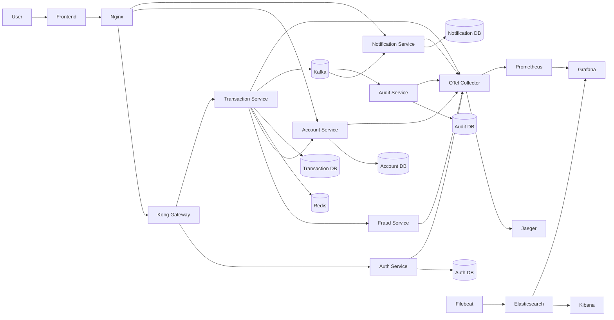

# System Architecture

> This document is completed **after** [Analysis and Design](analysis-and-design.md).
> Based on the Service Candidates and Non-Functional Requirements identified there, select appropriate architecture patterns and design the deployment architecture.

**References:**
1. *Service-Oriented Architecture: Analysis and Design for Services and Microservices* — Thomas Erl (2nd Edition)
2. *Microservices Patterns: With Examples in Java* — Chris Richardson
3. *Bài tập — Phát triển phần mềm hướng dịch vụ* — Hung Dang (available in Vietnamese)

---

## 1. Pattern Selection

Select patterns based on business/technical justifications from your analysis.

| Pattern | Selected? | Business/Technical Justification |
|---------|----------|-----------------------------|
| API Gateway | Có | Được dùng cho auth và transfer để gom entry point và kiểm tra JWT cho API chuyển tiền. |
| Reverse Proxy | Có | Phục vụ frontend và route request `/api/*` tới Kong hoặc service phù hợp. |
| Database per Service | Có | Mỗi service sở hữu dữ liệu riêng, tránh phụ thuộc chéo ở tầng database. |
| Shared Database | Không | Không dùng DB chia sẻ logic giữa các service. Các liên kết giữa service là qua API hoặc Kafka event. |
| Saga | Có | Vì luồng chuyển tiền đi qua nhiều service với database độc lập nên cần đảm bảo tính nhất quán nghiệp vụ khi có lỗi xảy ra ở giữa chừng. |
| Outbox Pattern | Có | Ghi `outbox_events` trước khi publish Kafka để tránh mất event khi broker lỗi tạm thời. |
| Event-driven / Message Queue | Có | Dùng để phát transfer event sang notification-service và audit-service. |
| CQRS | Không hoàn chỉnh | Có tách một phần write path và read path theo event ở notification/audit, nhưng chưa triển khai CQRS đầy đủ. |
| Circuit Breaker | Có | Tránh tình huống giao dịch chuyển tiền bị chậm, timeout, lỗi dây chuyền khi service phụ gặp lỗi. |
| Idempotency | Có | Redis lưu `Idempotency-Key` để tránh retry cùng request tạo nhiều transfer. |
| Observability | Có | Giám sát trạng thái của hệ thống. |
| Service Registry / Discovery | Không | Môi trường triển khai dùng route tĩnh và Docker Compose DNS, chưa cần service registry/discovery. |

---

## 2. System Components

| Component | Responsibility | Tech Stack | Port |
|------------|-------------|-----------|------|
| Frontend | Serve giao diện web, reverse proxy cho `/api/*` | HTML/CSS/JS + Nginx | 80 |
| Gateway | Route auth/transfer, kiểm tra JWT cho transfer API | Kong Gateway | 8000 |
| Kong Admin API | Quản trị route, plugin, consumer/JWT credential | Kong Admin | 8001 |
| Auth Service | Đăng ký, đăng nhập, sinh JWT, đồng bộ consumer vào Kong | Spring Boot, Spring Security, PostgreSQL | 8081 |
| Account Service | Tạo tài khoản, tra cứu số dư, debit/credit/compensate | Spring Boot, JPA, PostgreSQL | 8082 |
| Fraud Detection Service | Kiểm tra luật gian lận cho giao dịch | Spring Boot | 8083 |
| Transaction Service | Điều phối chuyển tiền, saga, outbox, idempotency | Spring Boot, JPA, Redis, Kafka | 8084 |
| Notification Service | Consume transfer event, tạo và truy vấn notification | Spring Boot, Kafka, JPA | 8085 |
| Audit Service | Consume transfer event, lưu audit log nghiệp vụ | Spring Boot, Kafka, JPA | 8086 |
| PostgreSQL | Lưu dữ liệu nghiệp vụ của các service | PostgreSQL 16 | 5432 |

---

## 3. Communication

Inter-service Communication Matrix

| From -> To | Frontend | Nginx | Kong | Auth | Account | Fraud | Transaction | Notification | Audit | Redis | Kafka | PostgreSQL | OTel Collector | Prometheus |
|------------|----------|-------|------|------|---------|-------|-------------|--------------|-------|-------|-------|------------|----------------|------------|
| Frontend | - | HTTP | - | - | - | - | - | - | - | - | - | - | - | - |
| Nginx | - | - | HTTP | HTTP | HTTP | - | HTTP | HTTP | - | - | - | - | - | - |
| Kong | - | - | - | HTTP | - | - | HTTP | - | - | - | - | - | - | - |
| Auth | - | - | Admin API | - | - | - | - | - | - | - | - | PostgreSQL | OTLP | Prometheus scrape |
| Transaction | - | - | - | - | HTTP | HTTP | - | - | - | Redis | Kafka | PostgreSQL | OTLP | Prometheus scrape |
| Notification | - | - | - | - | - | - | - | - | - | - | Consume | PostgreSQL | OTLP | Prometheus scrape |
| Audit | - | - | - | - | - | - | - | - | - | - | Consume | PostgreSQL | OTLP | Prometheus scrape |
| Account | - | - | - | - | - | - | - | - | - | - | - | PostgreSQL | OTLP | Prometheus scrape |
| Fraud | - | - | - | - | - | - | - | - | - | - | - | - | OTLP | Prometheus scrape |

---

## 4. Architecture Diagram

---

## 5. Deployment

### 5.1 Chế độ core

Dùng cho chạy demo nhẹ hơn:
- Nginx frontend
- Kong
- Kafka / Kafka init
- Redis
- PostgreSQL
- các Spring Boot service chạy riêng

### 5.2 Chế độ full

Bật thêm stack observability:
- Jaeger
- OpenTelemetry Collector
- Prometheus
- Grafana
- Kibana
- Filebeat
- Dùng `Micrometer + OTLP + Prometheus + Jaeger` để có observability thực tế thay vì chỉ dừng ở log console.
